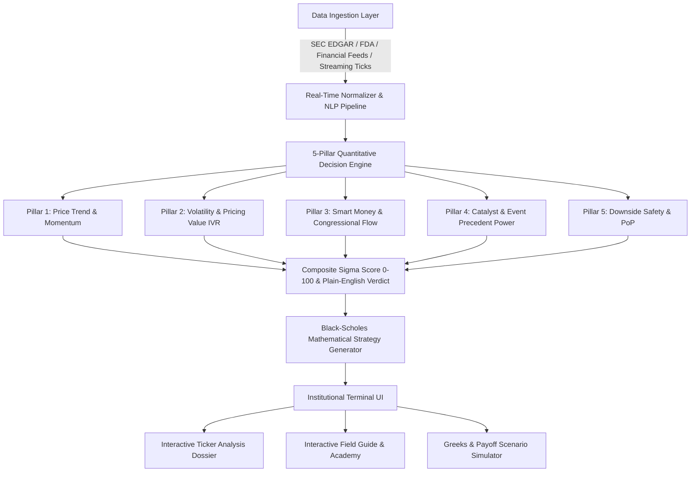

# Σ SigmaPulse — Architecture, 5-Pillar Decision Framework & Data Ingestion

## 1. System Architecture Overview

SigmaPulse is engineered as a high-density, institutional-grade quantitative trading platform. It unifies distributed data crawlers, mathematical derivatives pricing, and an intuitive **5-Pillar Decision Framework**:

---

## 2. The 5-Pillar Decision Framework (Layman Friendly, Institutional Underneath)

To make high-level quantitative analysis accessible for any trader without sacrificing mathematical depth, SigmaPulse condenses dozens of underlying signals into **5 Plain-English Decision Pillars**:

### 📈 Pillar 1: Price Trend & Momentum (Weight: 22%)
- **Layman Meaning**: *Is the stock moving up with real buyer strength?*
- **Underlying Signals**: 20/50/200 EMA crossovers, 14-day RSI accumulation velocity, support/resistance channel proximity, and relative volume surges.
- **Score (0-100)**: $> 80$ indicates strong institutional accumulation with low selling pressure.

### ⚡ Pillar 2: Volatility & Pricing Value (IVR) (Weight: 20%)
- **Layman Meaning**: *Are options on sale, or are they expensive enough to sell for daily income?*
- **Underlying Signals**: Implied Volatility Rank (IVR), IV vs Historical Volatility Spread, Volatility Skew.
- **Score (0-100)**:
  - **$\text{IVR} \le 35\%$**: Options are cheap $\rightarrow$ Outright Long Calls / Straddles.
  - **$\text{IVR} \ge 70\%$**: Options are expensive $\rightarrow$ Vertical Debit Spreads or Iron Condors to harvest daily theta decay.

### 🏛️ Pillar 3: Smart Money & Congressional Flow (Weight: 18%)
- **Layman Meaning**: *Are politicians and corporate insiders buying?*
- **Underlying Signals**: Real-time STOCK Act disclosures cross-referenced with Congressional committee assignments (Armed Services, Intelligence, Health) and committee conflict indices.
- **Score (0-100)**: High score indicates active accumulation by influential policymakers ahead of major legislation.

### 🎯 Pillar 4: Catalyst & Event Power (Weight: 22%)
- **Layman Meaning**: *What upcoming news event will spark the price jump, and how reliably has it worked in the past?*
- **Underlying Signals**: 10-year historical backtest distribution for matching catalyst types (FDA PDUFA dates, Quantum hardware benchmarks, CHIPS Act subsidies, Defense awards).
- **Score (0-100)**: Proportional to the historical 5-day and 30-day win rate (e.g. 86% win rate $\rightarrow$ 86/100 score).

### 🛡️ Pillar 5: Downside Safety & Protection (Weight: 18%)
- **Layman Meaning**: *Is your money protected if the market suddenly drops?*
- **Underlying Signals**: Probability of Profit (PoP), strict maximum loss capping (net debit risk limit), and delta-hedging buffer.
- **Score (0-100)**: High score guarantees defined asymmetric risk where maximum loss is known in advance and cannot exceed the initial debit.

---

## 3. Where the Data Comes From & Real-Time Engine

### A. Real-Time Data Feeds
1. **Regulatory & Congressional Sources**:
   - **SEC EDGAR (8-K, 10-Q, Form 4)**: Real-time corporate and insider transaction tracking.
   - **Capitol Trades & STOCK Act Reports**: Monitored daily for House and Senate disclosures.
   - **FDA Regulatory Filings**: PDUFA target dates and Advisory Committee endorsements.
2. **Financial News & Sentiment Feeds**:
   - Institutional wires, Bloomberg/Reuters RSS feeds, and specialized defense/quantum publications.
   - NLP sentiment classifier scoring each article from $-1.0$ (Very Bearish) to $+1.0$ (Very Bullish) with urgency weighting (`EXTREME`, `HIGH`, `MEDIUM`).
3. **Price & Volatility Market Engine**:
   - High-precision sub-second tick engine generating realistic Brownian micro-ticks, dynamic bid/ask spreads, and level-2 order book depth.

---

## 4. Mathematical Models & Equations

### A. Black-Scholes-Merton Pricing Model
$$d_1 = \frac{\ln(S / K) + (r - q + \frac{1}{2}\sigma^2)T}{\sigma \sqrt{T}}, \quad d_2 = d_1 - \sigma \sqrt{T}$$

$$\text{Call Price} = S e^{-qT} \Phi(d_1) - K e^{-rT} \Phi(d_2)$$
$$\text{Put Price} = K e^{-rT} \Phi(-d_2) - S e^{-qT} \Phi(-d_1)$$

Where $\Phi(x)$ is computed via the Hart polynomial rational approximation.

### B. Analytical Greeks Sensitivities
- **Delta ($\Delta$)**: $\partial V / \partial S$
- **Gamma ($\Gamma$)**: $\partial^2 V / \partial S^2$
- **Theta ($\Theta$)**: $\partial V / \partial t$ (Daily decay $\Theta / 365$)
- **Vega ($\nu$)**: $\partial V / \partial \sigma \times 0.01$
- **Rho ($\rho$)**: $\partial V / \partial r \times 0.01$

### C. Implied Volatility Solver (Newton-Raphson)
$$\sigma_{n+1} = \sigma_n - \frac{C_{\text{BS}}(\sigma_n) - C_{\text{market}}}{\nu(\sigma_n)}$$
With automatic bisection fallback.
