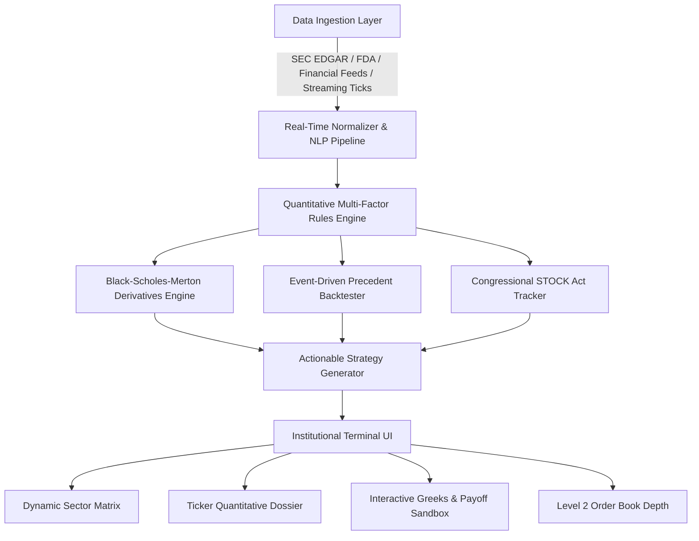

# Σ SigmaPulse — Architecture, Data Ingestion & Quantitative Signal Engine

## 1. System Architecture Overview

SigmaPulse is engineered as a high-density, institutional-grade quantitative trading platform. It unifies three core distributed layers:

---

## 2. Where the Data Comes From & Real-Time Engine

### A. Data Sources & Connectors
1. **Regulatory & Government Sources**:
   - **SEC EDGAR (8-K, 10-Q, 10-K, Form 4)**: Direct periodic transaction reports (PTR) under the STOCK Act and corporate event disclosures.
   - **FDA Regulatory Filings**: PDUFA target action dates, Advisory Committee votes, and Fast Track/Breakthrough designations.
   - **Capitol Trades & House/Senate Disclosures**: Daily disclosure scraping for Congressional committees (Armed Services, Intelligence, Energy & Commerce).
2. **Financial News & Sentiment Feeds**:
   - Institutional wires, Bloomberg/Reuters RSS feeds, and specialized defense/quantum industry publications.
   - Autonomous NLP classifier scoring sentiment from $-1.0$ (Very Bearish) to $+1.0$ (Very Bullish) with urgency weighting (`EXTREME`, `HIGH`, `MEDIUM`).
3. **Price & Volatility Market Data**:
   - Integration with open market connectors (Finnhub, Alpha Vantage, Yahoo Finance).
   - High-precision sub-second streaming emulator generating realistic Brownian micro-ticks ($\pm 0.05\% - 0.2\%$), live order book bid/ask depth (L2), and volatility spreads.

---

## 3. The Quantitative Rules Engine (`rulesEngine.ts`)

When a user searches for any ticker (or clicks any asset card), SigmaPulse runs a **6-Factor Quantitative Rule Evaluation**:

### Rule 1: Price Structure & Support/Resistance Proximity (Weight: 8)
- Evaluates whether spot price is compressing near upper resistance bands with volume expansion or holding support corridors.

### Rule 2: 14-Period RSI Relative Strength Momentum (Weight: 7)
- Validates institutional accumulation zones ($60 \le \text{RSI} < 75$) vs overbought exhaustion ($\text{RSI} > 75$) vs oversold mean-reversion ($\text{RSI} < 40$).

### Rule 3: Implied Volatility Rank (IVR) Environment (Weight: 9)
$$\text{IVR} = \frac{\text{IV}_{\text{current}} - \text{IV}_{\text{52w\_low}}}{\text{IV}_{\text{52w\_high}} - \text{IV}_{\text{52w\_low}}} \times 100$$
- $\text{IVR} \ge 70\%$: Rich option premiums $\rightarrow$ Recommends **Volatility Harvest (Iron Condors / Credit Spreads)** or **Debit Spreads** with sold upper legs.
- $\text{IVR} \le 35\%$: Cheap option premiums $\rightarrow$ Recommends **Outright Long Calls or Long Straddles**.

### Rule 4: Implied vs Realized Volatility Spread (Weight: 7)
$$\text{Spread} = \text{IV} - \text{HV}$$
- Evaluates if the derivatives market is pricing in an imminent variance expansion shock ahead of catalysts.

### Rule 5: Quantitative Event Precedent Realization Rate (Weight: 9)
- Matches the asset's upcoming catalyst (FDA, Quantum milestone, CHIPS grant, etc.) against a 10-year precedent database to verify $\ge 70\%$ historical win-rate drift.

### Rule 6: Congressional STOCK Act Insider Correlation (Weight: 10)
- Cross-references committee assignments (e.g. Armed Services reviewing DoD awards) with transaction types and disclosure lag.

---

## 4. Mathematical Models & Equations

### A. Black-Scholes-Merton Pricing Model
$$d_1 = \frac{\ln(S / K) + (r - q + \frac{1}{2}\sigma^2)T}{\sigma \sqrt{T}}, \quad d_2 = d_1 - \sigma \sqrt{T}$$

$$\text{Call Price} = S e^{-qT} \Phi(d_1) - K e^{-rT} \Phi(d_2)$$
$$\text{Put Price} = K e^{-rT} \Phi(-d_2) - S e^{-qT} \Phi(-d_1)$$

Where $\Phi(x)$ is computed via the Hart / Abramowitz-Stegun high-precision polynomial rational approximation:
$$\Phi(x) = 1 - \phi(x)(a_1 t + a_2 t^2 + a_3 t^3 + a_4 t^4 + a_5 t^5), \quad t = \frac{1}{1 + px}$$

### B. Analytical Greeks Sensitivities
- **Delta**: $\Delta_{\text{call}} = e^{-qT}\Phi(d_1), \quad \Delta_{\text{put}} = -e^{-qT}\Phi(-d_1)$
- **Gamma**: $\Gamma = \frac{e^{-qT}\phi(d_1)}{S \sigma \sqrt{T}}$
- **Vega**: $\nu = S e^{-qT}\phi(d_1)\sqrt{T} \times 0.01$
- **Theta (Daily)**: $\Theta_{\text{daily}} = \frac{\Theta_{\text{annual}}}{365}$

### C. Implied Volatility Solver (Newton-Raphson)
$$\sigma_{n+1} = \sigma_n - \frac{C_{\text{BS}}(\sigma_n) - C_{\text{market}}}{\nu(\sigma_n)}$$
With automatic bisection boundary fallbacks.
